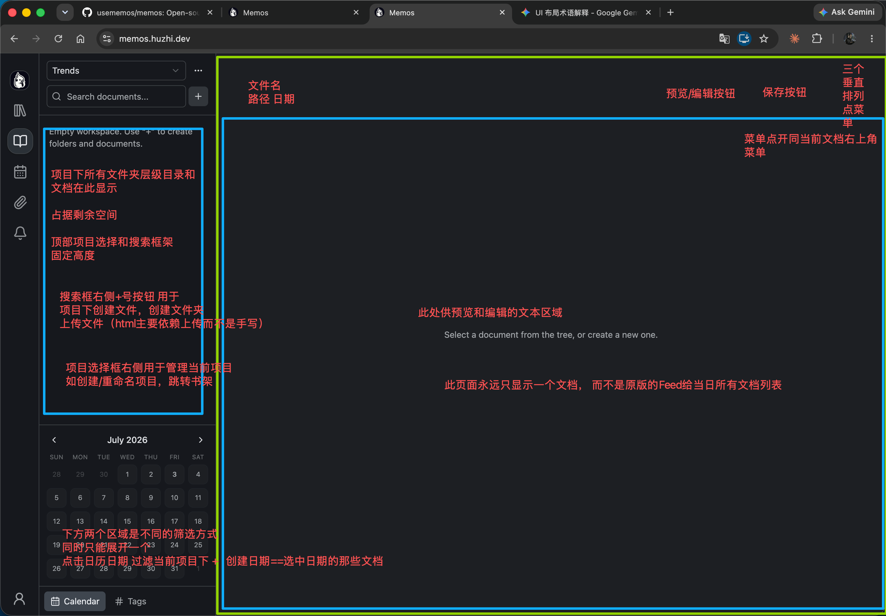
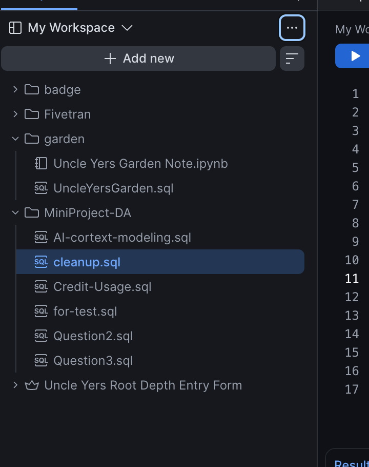
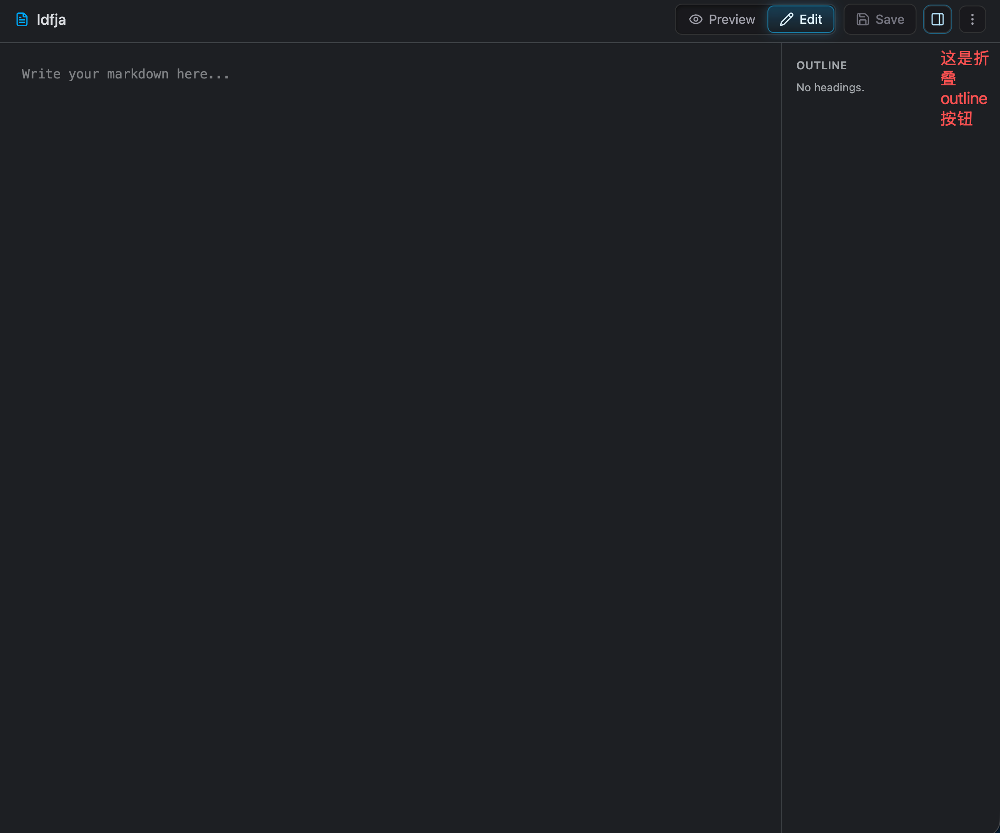

# 知识库层级结构（Workspace + 文档树）

文档按「知识库（workspace）+ 文件夹路径」组织，取代早期"单 memo 单兵作战"的
扁平笔记模型。不允许无归属文档存在。

## 1. 核心实体

**Workspace**（知识库）是顶层容器，文档树按路径挂在其下。API 定义见
`proto/api/v1/workspace_service.proto`，`WorkspaceService` 提供：
`CreateWorkspace` / `ListWorkspaces`（支持 `show_hidden`）/ `GetWorkspace` /
`UpdateWorkspace`（field mask）/ `DeleteWorkspace`（物理删除，**保留但不在
UI 暴露**，产品语义上的删除是软删除 `hidden`，见
[workspace-detail-and-shelf.md](workspace-detail-and-shelf.md)）/
`GetWorkspaceTree` / `CreateWorkspaceFolder` / `RenameWorkspaceFolder` /
`MoveWorkspaceFolder`（跨知识库移动文件夹）/ `DeleteWorkspaceFolder`
（仅限空文件夹）。

**文档的归属**：`store/memo.go` 的 `Memo` 结构体带
`WorkspaceID`、`FolderPath`（相对 workspace 根的斜杠分隔路径）、`Title`、
`DocType`（`MARKDOWN` / `HTML` / `PDF` / `VIEW`，见
[../render-only-doc-types.md](../views/render-only-doc-types.md)）。
`FindMemo.FolderPathPrefix` 支持前缀/子树查询（`FolderPath == prefix OR
FolderPath LIKE prefix + "/%"`），重命名/移动文件夹靠前缀批量 `UPDATE`。

**没有独立的"文件夹"表作为文档树的事实来源** —— 文件夹是从
`Memo.FolderPath` 字符串前缀推导出来的。`WorkspaceFolder` 表
（`proto/store/workspace.proto`）只用来持久化**空文件夹**以及支撑重命名时
的文件夹身份延续，"至少含一篇文档的文件夹"不需要在这张表里有行。

## 2. 文档树接口

`GetWorkspaceTree(workspace, archived)` 一次查询返回整棵树
（`server/router/api/v1/workspace_service.go`）：拉取该 workspace 下全部
memo（排除评论）与 `WorkspaceFolder` 空文件夹占位行，按 `FolderPath` 切分
组装成树；按 `RowStatus == Archived` 与请求的 `archived` 参数过滤 ——
归档与未归档是两棵互斥的树视图，不是同一棵树里的一个标记位。首页专用的
"home folder" 文档不出现在树里。

`WorkspaceTreeNode` 字段：`type`（FOLDER/DOCUMENT）、`name`、`path`、
`memo`（仅 DOCUMENT）、`archived`、`doc_type`、`create_time`、
`update_time`、`children`（仅 FOLDER）。

文件夹操作分两个语义不同的 RPC：
- `RenameWorkspaceFolder`：同一 workspace 内的路径改名，级联更新该文件夹下
  所有文档与子文件夹的 `FolderPath`，并尽力修复指向被移动路径的跨文档链接
  （`repairFolderMoveReferencesBestEffort`），同时触发 RAG 重新索引
  （`reindexFolder`）。
- `MoveWorkspaceFolder`：把一棵文件夹子树迁到**另一个** workspace（可指定
  目标父路径），文件夹保持原名，落在
  `{目标父路径}/{原文件夹名}`，返回新路径与迁移文档数。
- `DeleteWorkspaceFolder`：仅允许对空文件夹操作。

## 3. 首页（Notebook）

路由：`/:workspaceTitle`（当前知识库根）与 `/:workspaceTitle/:docId`（单篇
文档），由 `web/src/pages/Notebook.tsx` 渲染，`isNotebookRoute()`
（`web/src/router/notebookRoute.ts`）判定一个路径是否属于该页面（需排除
`ROUTES` 里已占用的顶层路径，如 `/shelf`、`/explore` 等，避免与
`:workspaceTitle` 通配冲突）。`/` 会重定向到 Home 页，不是 Notebook 自己的
路由。

**Secondary Sidebar**（`NotebookSidebar`，Notebook 页面私有，不与
Home/Explore 共用）：顶部知识库选择器（`WorkspaceSelector`）+
搜索/过滤框（新建文档 / 新建 view / 新建文件夹 / 上传 / 上传 PDF 等入口）+
中部文件树（`FileTreeNode`，按 doc type 区分图标，支持重命名/移动/归档/
删除）+ 底部月历（`MonthCalendar`，按创建日期过滤当前知识库文档）与 tag
过滤 + 归档 checkbox（选中只看已归档，未选中只看未归档，两者互斥而非
叠加）。窄视口或文档的 `docConfig.displayFilter` 为 false 时自动折叠。

**Main content**：单文档视图（`DocumentView.tsx`）。默认 Preview，可切到
Edit；outline 面板仅对 markdown 文档生效（从 AST 提标题，点击滚动定位）；
HTML/PDF/VIEW 文档各自的渲染方式见
[../views/render-only-doc-types.md](../views/render-only-doc-types.md) 与
[../views/gallery-view.md](../views/gallery-view.md)。

## 4. 上次打开位置的记忆

`UserSetting.Key.LAST_OPENED`（`proto/store/user_setting.proto`）记录的是
`LastOpenedUserSetting{workspace, memo, workspace_memos}`：`workspace_memos`
是 `workspace 名 → 该 workspace 下最后一篇文档名` 的映射，是当前实际生效
的机制；单值的 `memo` 字段已标记为 deprecated，仅为兼容保留。前端
`web/src/hooks/useLastOpened.ts` 的 `getLastOpened()`/`setLastOpened()`
读写这份设置，写入是 fire-and-forget（失败不阻塞 UI）。进入书架页打开某个
知识库、或在 Notebook 内切换文档时都会调用 `setLastOpened`。

## 5. Explore 页

保留原首页/Explore 页的 feed 逻辑，Secondary Sidebar 额外提供：知识库选择
器（`ExploreWorkspaceSelect`，含"所有项目"选项）、可见性多选（private /
protected / public，`ExploreVisibilityAndArchivedFilters`）、归档
checkbox。均实现在 `web/src/components/MemoExplorer/ExploreFilters.tsx`，
落到 `ListMemos` 的 filter 参数上。VIEW 类型文档不出现在 feed 里，见
[../views/render-only-doc-types.md](../views/render-only-doc-types.md)
的排除规则。

## 6. 书架页

见 [workspace-detail-and-shelf.md](workspace-detail-and-shelf.md)。

## 7. 跨文档引用修复

文档移动/重命名/归档/删除时的引用完整性维护是独立的一块需求，见
[../cross-reference-repair-on-move-rename.md](../cross-reference-repair-on-move-rename.md)。

## 8. 关联图片

