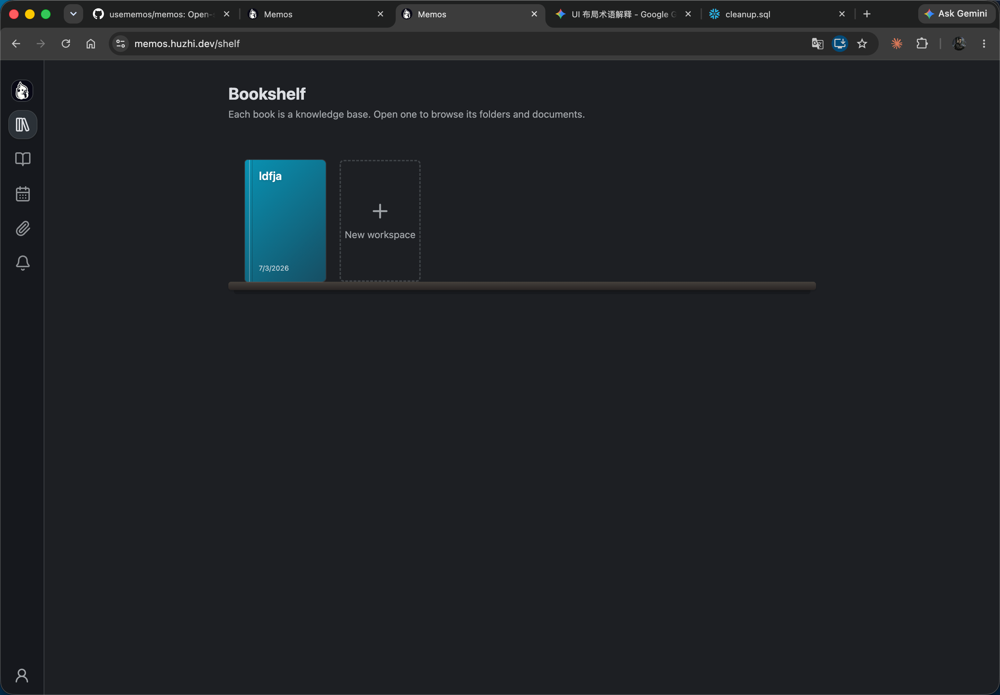

# 知识库详情页 + 书架

知识库以书架形式陈列，管理动作收敛到独立的知识库详情页；删除是可恢复的
软删除。技术方案见
[../../design/20260804-workspace-detail-and-shelf.md](../../design/20260804-workspace-detail-and-shelf.md)。

## 1. 书架页 `/shelf`

`web/src/pages/Bookshelf.tsx`：按 `display_order ASC, created_ts ASC`
排列书脊卡片（`BookSpine` 组件，标题过长以 `...` 截断）；默认只显示可见
知识库，提供"显示已隐藏"开关，开启后隐藏的知识库以半透明/灰度呈现并可
"取消隐藏"；提供新建知识库入口。点击某本书跳转到该知识库首页
（`/:workspaceTitle`）并记录为上次打开。

## 2. 知识库详情页 `/shelf/:workspaceUid`

`web/src/pages/WorkspaceDetail.tsx`，独立路由页面（非弹窗），
`workspaceDetailPath()`（`web/src/router/routes.ts`）由资源名
`workspaces/{uid}` 生成 URL。

展示内容：书籍样式封面预览（复用 `BookSpine`，尺寸放大）、标题、创建/更新
时间、创建者、统计（文档数、文件夹数，由前端汇总 `GetWorkspaceTree` 的结果，
不需要专门的后端字段）、当前排序设置、隐藏状态、`display_order`。

提供操作：Rename（`UpdateWorkspace(update_mask=["title"])`）、New
workspace（新建后跳转到新知识库详情页）、Set cover（颜色/图片）、Order
（数字输入框手动设置 `display_order`）、Delete（隐藏，二次确认，文案说明
"隐藏后可恢复，数据不会丢失"）。

Notebook 左上角的知识库齿轮菜单只保留知识库级别的浏览设置：`open in new
tab`、`change cover`、`sort by`（文档树排序）、`go to bookshelf`，新建/
重命名/删除已收敛进详情页，齿轮菜单新增"知识库详情"入口跳转过去。

## 3. 软删除（隐藏）

`Workspace.hidden`（布尔）是软删除标记，默认可见。隐藏后：书架默认不展示、
Notebook 的知识库下拉不展示；若当前正打开该知识库则跳回书架。`hidden` 的
知识库仍可通过 UID 直接访问（否则恢复流程本身不可达），只是从列表类入口
排除：Explore feed、RAG 搜索、MCP `workspace_list_workspaces`、全局搜索、
附件浏览都需要排除隐藏知识库。

物理删除不在本期提供。`DeleteWorkspace` RPC 保留（要求知识库为空）但**前端
不再调用**，`proto/api/v1/workspace_service.proto` 注释里已标注"不在 UI
暴露，不要在没有明确决策的情况下重新接上"。

## 4. 手动排序

`Workspace.display_order`（`int32`，默认 0）决定书架上的固定位置；数字越小
越靠前。允许重复、不要求连续，重复值按 `created_ts` 兜底排序保证稳定。不做
拖拽排序，只能在详情页用数字输入设置。

## 5. API

`proto/api/v1/workspace_service.proto` 的 `Workspace` 消息带
`display_order`（字段 11）与 `hidden`（字段 12）；`ListWorkspacesRequest`
带 `show_hidden`（默认 false，只返回可见知识库）。`UpdateWorkspace` 的
update_mask 支持 `display_order`、`hidden` 分支。

