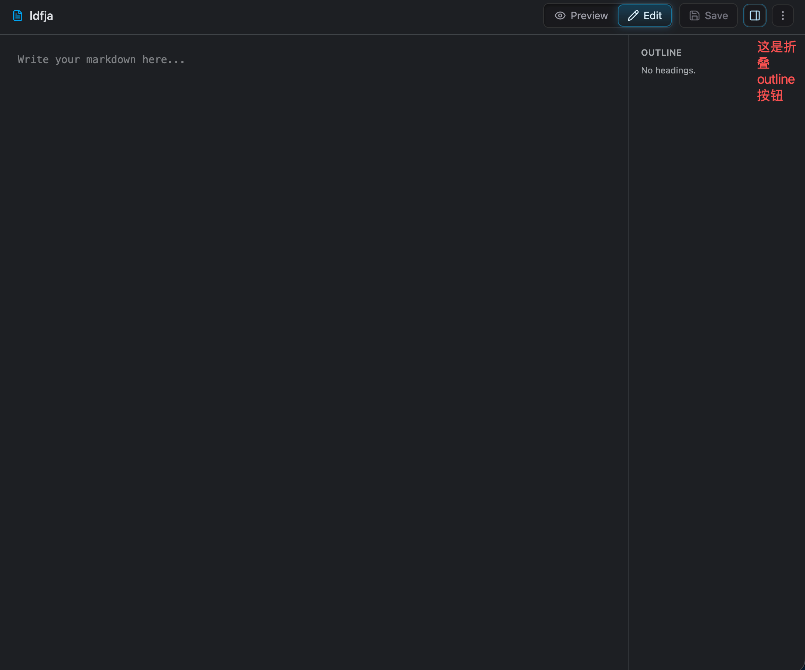
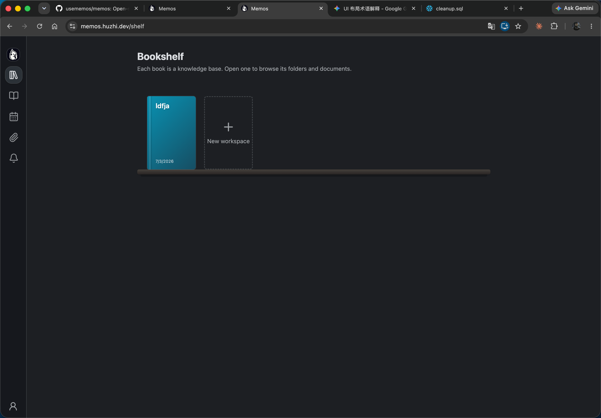

## Memos改造

这是	usememos/memos 开源项目官方fork的仓库

### 术语
下文许多地方所说的项目， 其实是知识库，之所以用项目是因为obsidian还有pycharm管理不同项目时叫项目， 但在本项目中，更确切的叫法应该是知识库

### 需求概述
现在我希望实现如下两个核心功能：

- hierarchical-notes 所有文档需要持在项目+路径下面
  - 对首页改造：日历，tags，搜索框等只是筛选器，层级文件夹才是左侧Secondary Sidebar的核心
- 支持独立的html文档渲染

### UI整体设计风格
必要时可引入与当前主题相匹配的其他UI组件，使UI设计走技术/科技感，不要使用落后的UI设计

## 需求拆解

### hierarchical-notes

#### 痛点：  
当前功能其实很有限，只有写一个一个的文档，这种场景相关替代品太多了，任意一个支持md的工具都能替代。 
实际情况下，像语雀一样有知识库+多级文件夹路径来管理 会让这个项目变得更有价值更强大。
它既不会像Notion那样需要数据库来管理多个md文档太笨重， 也不像语雀那样太多不相关内容且文档打开比较慢。  
总之，引入 项目（知识库）+文件夹层级路径，将使这个项目彻底强大起来。

#### 功能展示

除图片中给出的功能外，还需要注意以下细节：
1. 首页 需要记忆用户上次打开的项目， 下次进入首页，自动进入上次选中的项目和文档 
2. 进入首页，总是先显示预览，用户可手动切换到编辑模式
3. 右侧边区域显示md文档的outline，保存按钮右侧添加折叠按钮  如图所示。本功能只对md有效， html无该按钮无outline
4. Secondary Sidebar区域的层级文件夹设计 可以参考snowflake的workspace对文档的管理
5. 在Secondary Sidebar底部添加归档checkbox，如果选中，只显示已归档，否则只显示未归档
6. 原版memo的CRUD等API的同步升级
   - 比如，上传memo的接口必定至少需要添加一个file_path的参数 来决定文件上传的具体归属，新功能上线后不允许任何无组织文档存在（无旧数据）。

注意事项：
这个功能， 后端改动非常大， 因此必须考虑对原版memo的CRUD等API的同步升级。
这个功能的前后端改造=是本需求成功与否的关键KPI

### 书架功能
在新首页下方添加书架功能，将各个知识库以书籍样式陈列。

只做简单的陈列 

其他功能 如bookcover 换颜色等不在本次需求之列。只画书+跳转首页

### explore页面改造
项目的原首页和原Explore页面完全可以合并改造思路如下：

基本保留explore页面的所有功能（其实我感觉原首页和原explore差别非常小， 只是explore页只查看非private的文档），在此基本上，做如下实现：

1. 在Secondary Sidebar搜索框上方添加项目选择器，用户可以选项目，但不同的是，这里的文档选择器需要+选中所有项目的选项
2. 在Secondary Sidebar搜索框的底部添加 文档隐私权限的多选选择器， 可多选 private, protected, public
3. 在Secondary Sidebar搜索框的底部归档checkbox，如果选中，只显示已归档，否则只显示未归档

暂时先实现这么多，main content在这个explore页面下当前完全复用旧逻辑不做任何改动， 仅强化Secondary Sidebar区域的筛选项目 

至此， 新首页 hierarchical-notes 和 新explore页日历视图+feed 完成这两项目改造，写和查文档这块已经非常强大

### 支持HTML文档
当前AI时代， 以Claude为首的AI常常会返回Html响应， 这种文档往往能够独立运行，且传递的信息比md更有信息传递能力。因此使项目支持渲染一个个独立的html非常有必要。

需要实现的内容：
- 在新首页文本区，为html预览时，使用iframe或更新的前端技术来渲染html，webview框架注意应当和md渲染区域一样尽可能填充整个剩余main content空间
- html也支持编辑，但人工编辑的场景很少，所以只给个文本编辑器给源码即可，不需要提供特殊的html编辑支持

对html的支持，暂时只到这一层，本次需求不做太深

---

如上需求，实现后最左侧窄侧边栏 按钮顺序如下：
1. / 新首页 主要实现对层级文件夹的支持和全新的单文档预览编辑
2. /shlf 将知识库按书架的形式排列
3. /explore 主要为了尊重原创， 合并原首页和原explore， 同时做一点点体验上的提升
其他其实没啥用，暂时仅保留。

注意：重新调整上面三个左侧边栏按钮的icon，如阅读，书架，日历 分别作为新的icon来重好体现功能。

本次实现后，仍然会有很多逻辑需要闭环，比如分享public文档等等，这些需求，在下期实现。

## AI执行计划

一、项目现状要点（与本需求相关）
后端：Go 单体，API 由 proto/api/v1/*.proto 定义（AIP 风格资源名 memos/{uid}），生成 gRPC + Connect/REST 网关；数据层在 store/，三套驱动（SQLite/MySQL/Postgres），迁移体系为 store/migration/<driver>/<version>/ + LATEST.sql。
memo 表：id/uid/creator_id/row_status/content/visibility/pinned/payload，没有任何标题、归属、路径概念；标题目前是从首个 H1 计算进 payload 的。
前端：React + react-router，Home（feed 流）、Explore、Archived 等页面；侧边栏为 Navigation.tsx + MemoExplorer（日历/tags/搜索都在这里）。

二、需要先定案的决策点（均有推荐解，非卡点）
"知识库（项目）"需要新实体。推荐新建 workspace 表 + 独立 WorkspaceService API，而不是复用 tag 或 payload 硬塞。这是整个需求的地基。
file_path 的落库形态：推荐 memo 表加三列：workspace_id（外键，NOT NULL）、path（文件夹路径字符串，如 garden/notes，用字符串路径而非 folder 表——文件夹只是路径前缀，重命名/移动用前缀 UPDATE 即可，简单且够用；空文件夹需要时用一张轻量 workspace_folder 表补充，见计划）、doc_type（MARKDOWN/HTML）。另加 title 列（文件名），因为 HTML 文档没有 H1 可提取。
"不允许无组织文档存在（无旧数据）"：字面意思是不做旧数据迁移。但迁移脚本必须能处理已有库（包括你本地的 memos_prod.db），推荐迁移时自动建一个 "default" workspace 并把存量 memo 挂到其根路径下，代价极小，避免升级即坏库。
CreateMemo 强制 workspace+path：会破坏所有现有 API 客户端（如手机 App、快捷指令）。既然这是私有 fork 且需求明确"必须至少加 file_path 参数"，推荐：参数必填校验放在 API 层，但服务端对缺省值兜底到用户的 default workspace 根目录（防止第三方客户端直接不可用）。若你要求严格拒绝，改一行即可。
HTML 安全：iframe 渲染必须 sandbox（禁 same-origin 拿 cookie），HTML 内容本身仍存 content 字段（memo 一条记录一个文档），上传 .html 文件走"读文件内容→建 memo"而非 attachment。
同名冲突：同一 workspace+path 下文件名唯一（DB 唯一索引 workspace_id+path+title），冲突时 API 报错。

以上 6 点， 我已确认 全部使用推荐解

三、执行计划
Phase 1 — 后端：Workspace 实体（地基）
proto/store/workspace.proto + proto/api/v1/workspace_service.proto：Workspace{name, title, creator, create_time}，CRUD（List/Create/Update/Delete/Get）。
三驱动迁移：新建 workspace 表（id/uid/creator_id/title/created_ts/updated_ts）+ 轻量 workspace_folder 表（workspace_id/path，支持空文件夹与文件夹重命名的显式记录）。更新各 LATEST.sql 与新版本目录。
store/workspace.go + 三驱动实现；server/router/api/v1/workspace_service.go；注册路由与 ACL（仅创建者可见/可改，本期不做协作）。
Phase 2 — 后端：Memo 挂载到 workspace+path
memo 表加列：workspace_id BIGINT NOT NULL、path TEXT NOT NULL DEFAULT ''、title TEXT NOT NULL DEFAULT ''、doc_type TEXT DEFAULT 'MARKDOWN'；唯一索引 (workspace_id, path, title)；迁移脚本为存量数据创建 default workspace 并回填。
memo_service.proto：Memo 增加 workspace（资源名）、file_path（path + 文件名合一或分开两字段，推荐分 folder_path + title 两字段更干净）、doc_type；CreateMemo/UpdateMemo 支持；ListMemos filter 增加按 workspace、path 前缀、doc_type 过滤（现有 CEL filter 体系扩展）。
新增文档树接口：GetWorkspaceTree(workspace) 返回文件夹+文档的层级结构（一次查询按 path 组装，文档量级下无性能问题）；以及 MoveMemo/RenameFolder（前缀批量更新，事务内）。
同步升级：Archived 过滤（row_status 已有，无新工作）、memo webhook/inbox 等旁路逻辑回归验证。
Phase 3 — 后端：用户偏好记忆
user_setting.proto 加 Key：LAST_OPENED（workspace uid + memo uid），前端进首页时读取、切换时写入。
Phase 4 — 前端：新首页（核心，工作量最大）
新 pages/Notebook.tsx（路由 /，原 Home feed 逻辑迁入 Explore）：
Secondary Sidebar：顶部 workspace 选择器（右侧管理菜单：新建/重命名/跳转书架）+ 搜索框（右侧 +：新建文档/新建文件夹/上传文件，上传 .md/.html 解析为文档）；中部文件树（参考 Snowflake 样式：可折叠文件夹、文档图标区分 md/html、右键或 hover 菜单重命名/移动/归档/删除）；底部日历（点击按创建日期过滤当前项目文档）与 Tags 两个互斥展开区 + 归档 checkbox（选中只看已归档）。
Main content：单文档视图。头部：文件名+路径+日期 | Preview/Edit 切换（默认 Preview）| Save | outline 折叠按钮（仅 md）| 三点菜单。正文：md 用现有 MemoContent 渲染 + 右侧 Outline 面板（从 markdown AST 提标题，点击滚动定位）；编辑复用/裁剪 MemoEditor。
HTML 文档：Preview 用 sandbox iframe（srcdoc，占满剩余空间）；Edit 给纯文本源码编辑器（textarea/CodeMirror 按现有依赖取舍）；无 outline、无折叠按钮。
记忆恢复：进入 / 读 LAST_OPENED 自动打开上次 workspace+文档。
Phase 5 — 前端：书架页 /shelf
新 pages/Bookshelf.tsx：按配图做书脊卡片（title+创建日期）+ "New workspace" 虚线卡片，点击书跳转 /（并写入 last-opened）。纯 CSS 书架即可。
Phase 6 — 前端：Explore 改造 /explore
保留现有 feed/main content 不动；只强化其 Secondary Sidebar：搜索框上方加 workspace 选择器（含"所有项目"）、下方加 visibility 多选（private/protected/public）与归档 checkbox，全部落到 ListMemos 的 filter 参数。
Phase 7 — 导航与收尾
Navigation.tsx：顶部三按钮 /（阅读 icon）、/shelf（书架 icon）、/explore(日历 icon)，其余入口保留原位；路由表更新（原 Home feed 挪到 explore，/archived 保留）。
i18n（至少 en/zh-Hans）、深浅主题适配、buf generate + 前端 proto 类型再生成。
回归：三数据库迁移各跑一遍全新库+存量库；memo CRUD/webhook/分享链接冒烟；go test ./... 与前端 lint/build。
建议实施顺序与切分
按 Phase 顺序做，1+2 是关键路径（后端地基），4 是工作量大头。建议每个 Phase 一个 PR，Phase 2 完成后即可并行推进 4/5/6。粗略体量：后端 ~2.5k 行（含三驱动迁移与生成代码外的手写部分），前端 ~3.5k 行。